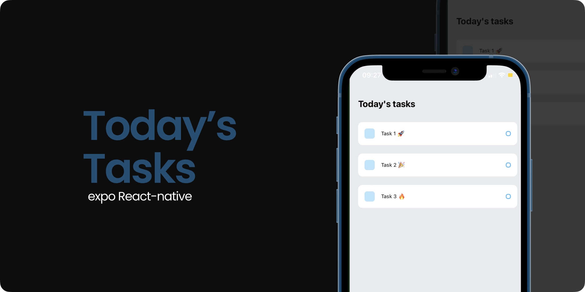

## 📱 Tela de Login

Este projeto é uma aplicação móvel construída com a plataforma Expo, que oferece uma experiência de criar uma simples lista de tarefas, ao ser concluida, a tarefa pode ser excluida.

  

## 🖥️ Funcionalidades

- Cadastro de Tarefas
- Excluir Tarefas

## 🎥 Apresentação 

  <video alt="License" src="./assets/videoapp.mp4">.</video>

## 🚀Tecnologias Utilizadas:

- Expo: Para desenvolvimento de aplicativos móveis multiplataforma.

## 📝 Notes

- [Expo Router: Docs](https://expo.github.io/router)
- [Expo Router: Repo](https://github.com/expo/router)
